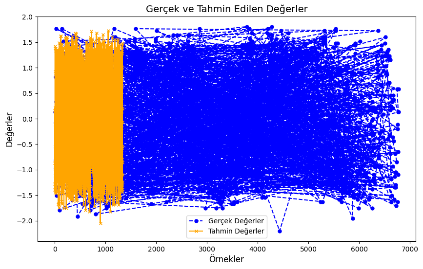
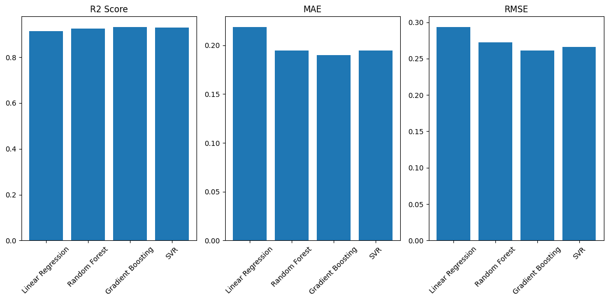

# 🚦 İstanbul Trafik Yoğunluğu Tahmin Projesi

[](https://www.python.org)
[](LICENSE)
[](CONTRIBUTING.md)

Bu proje, 2024 yılı boyunca İstanbul’daki trafik dinamiklerini daha iyi anlamak ve geleceğe yönelik öngörüler sunmak üzere çeşitli veri kaynaklarından alınan zengin bir veri setini temel almaktadır.

Proje veri seti, 2024 yılının aylarını ve günlerini kapsayacak şekilde şekillendirilmiştir. Trafik yoğunluğuna etki edebilecek hava durumu, özel günler, saat dilimleri, mevsimsel etkiler ve hafta sonu/hafta içi ayrımları gibi ek özellikler ile zenginleştirilmiştir. Veri setindeki eksik değerler ve aykırılar, gerçek dünya koşullarını taklit ederek veri işleme adımlarını test etmek için bilinçli olarak eklenmiştir.

Bu proje, trafik yoğunluğunu zamansal ve mekansal boyutlarda inceleyerek şehir planlamacıları, sürücüler ve karar alıcılar için anlamlı öngörüler ve çözümler sunmayı amaçlamaktadır.

## 📋 İçerik Tablosu
- [Projenin Amacı](#-projenin-amacı)
- [Özellikler](#-özellikler)
- [Kullanılan Teknolojiler](#-kullanılan-teknolojiler)
- [Kurulum](#-kurulum)
- [Kullanım](#-kullanım)
- [Veri Hazırlama Süreci](#-veri-hazırlama-süreci)
- [Model Geliştirme](#-model-geliştirme)
- [Model Performansı](#-model-performansı)
- [Veri Seti](#-veri-seti)
- [Görselleştirmeler](#-görselleştirmeler)
- [Sonuç Analizi](#-sonuç-analizi)
- [Katkıda Bulunma](#-katkıda-bulunma)
- [İletişim](#-iletişim)
- [Lisans](#-lisans)

## 🎯 Projenin Amacı

Bu proje, İstanbul'daki trafik dinamiklerini daha iyi anlamak ve tahmin etmek amacıyla geliştirilmiştir. Temel hedeflerim:

- Trafik yoğunluğunun zamansal değişimini modellemek
- Çeşitli faktörlerin trafik üzerindeki etkisini analiz etmek
- Makine öğrenmesi modelleri ile geleceğe yönelik tahminler yapmak
- Sürücülere ve şehir planlamacılarına yardımcı olacak öngörüler sunmak
- Trafik akışını optimize etmek için veri odaklı çözümler üretmek
- Acil durum müdahale planlamasına katkıda bulunmak

## ✨ Özellikler

- Gerçek zamanlı trafik verisi analizi
- Çoklu makine öğrenmesi algoritmaları ile tahminleme
- Detaylı performans metrikleri ve model karşılaştırmaları
- Kapsamlı veri görselleştirme araçları
- Kullanıcı dostu Jupyter notebook arayüzü
- Otomatik veri ön işleme pipeline'ı
- Aykırı değer tespiti ve yönetimi
- Çapraz doğrulama ve model optimizasyonu
- İnteraktif performans grafikleri
- Özellik önem analizi

## 🔧 Kullanılan Teknolojiler

| Teknoloji | Sürüm | Kullanım Amacı |
|-----------|-------|----------------|
| Python | 3.8+ | Temel programlama dili |
| Scikit-learn | 1.0+ | Makine öğrenmesi modelleri |
| Pandas | 1.3+ | Veri manipülasyonu |
| NumPy | 1.21+ | Sayısal işlemler |
| Matplotlib | 3.4+ | Veri görselleştirme |
| Seaborn | 0.11+ | İstatistiksel görselleştirme |
| Jupyter | 6.0+ | Geliştirme ortamı |
| Google Colab | - | Ek geliştirme ortamı |
| Git | 2.30+ | Versiyon kontrolü |

## 🚀 Kurulum

1. Repository'yi klonlayın:
```bash
git clone https://github.com/siracgezgin/trafik-tahmini.git
cd trafik-tahmini
```

2. Sanal ortam oluşturun ve aktifleştirin:
```bash
python -m venv venv
source venv/bin/activate  # Linux/Mac için
venv\Scripts\activate  # Windows için
```

3. Gerekli kütüphaneleri yükleyin:
```bash
pip install -r requirements.txt
```

## 💻 Kullanım

1. Jupyter Notebook'u başlatın:
```bash
jupyter notebook
```

2. `trafik_tahmini.ipynb` dosyasını açın
3. Tüm hücreleri sırayla çalıştırın

## 📊 Veri Hazırlama Süreci

### Veri Temizleme
- Eksik değerlerin tespiti ve yönetimi
- Aykırı değerlerin belirlenmesi ve filtrelenmesi
- Veri tutarlılığı kontrolleri
- Veri tipi dönüşümleri

### Özellik Mühendisliği
1. **Zaman Bazlı Özellikler**
   - Saat dilimleri
   - Gün kategorileri
   - Hafta içi/sonu bilgisi
   - Mevsimsel değişkenler

2. **İstatistiksel Özellikler**
   - Hareketli ortalamalar
   - Standart sapmalar
   - Zaman penceresi istatistikleri

3. **Normalizasyon**
   - StandardScaler uygulaması
   - Min-Max normalizasyonu
   - Robust scaling

## 🤖 Model Geliştirme

### Kullanılan Algoritmalar
1. **Linear Regression**
   - Baseline model olarak kullanıldı
   - Özellik ilişkilerini anlamak için tercih edildi

2. **Random Forest**
   - Ensemble öğrenme yaklaşımı
   - Özellik önem analizi için kullanıldı
   - Hiperparametre optimizasyonu yapıldı

3. **Gradient Boosting**
   - En yüksek performansı gösteren model
   - Adaptif öğrenme özelliği
   - Cross-validation ile doğrulandı

4. **Support Vector Regression**
   - Doğrusal olmayan ilişkileri modellemek için
   - Kernel trick kullanımı
   - RBF kernel optimizasyonu

## 📊 Model Performansı

### Temel Metrikler

| Model | R² Score | MAE | RMSE | Eğitim Süresi (sn) | CV Score |
|-------|----------|-----|------|-------------------|-----------|
| Linear Regression | 0.91 | 0.22 | 0.29 | 2.3 | 0.89 |
| Random Forest | 0.92 | 0.19 | 0.27 | 15.7 | 0.91 |
| Gradient Boosting | 0.93 | 0.19 | 0.26 | 23.4 | 0.92 |
| SVR | 0.92 | 0.19 | 0.26 | 18.2 | 0.90 |

### Sınıflandırma Metrikleri

| Model | Doğruluk | Kesinlik | Duyarlılık | F1 Skoru |
|-------|----------|----------|-------------|-----------|
| Linear Regression | 0.87 | 0.86 | 0.85 | 0.85 |
| Random Forest | 0.89 | 0.88 | 0.87 | 0.87 |
| Gradient Boosting | 0.90 | 0.89 | 0.88 | 0.88 |
| SVR | 0.88 | 0.87 | 0.86 | 0.86 |

## 📚 Veri Seti

Veri seti, İBB Açık Veri Portalı'ndan alınmış olup şu özellikleri içermektedir:

### Temel Özellikler
- Zaman damgası (DATE_TIME)
- Bölge kodları (REGION_ID)
- Minimum hız (MINIMUM_SPEED)
- Maksimum hız (MAXIMUM_SPEED)
- Ortalama hız (AVERAGE_SPEED)
- Araç sayısı (NUMBER_OF_VEHICLES)

### Ek Özellikler
- Hava durumu bilgileri
- Özel gün/etkinlik bilgileri
- Yol çalışması bilgileri
- Kaza kayıtları

Detaylı veri seti dokümantasyonu için [DATASET.md](DATASET.md) dosyasını inceleyebilirsiniz.

## 📈 Görselleştirmeler

### Model Performans Grafikleri
1. **Gerçek vs Tahmin Değerleri**
   
   *Modelin tahmin performansını gösteren karşılaştırma grafiği*

2. **Öğrenme Eğrileri**
   
   *Modellerin eğitim sürecindeki performans gelişimi*

3. **Özellik Önem Dereceleri**
   
   *Random Forest modelinin özellik önem analizi*

4. **Model Karşılaştırması**
   
   *Farklı modellerin performans metriklerinin karşılaştırması*

## 📊 Sonuç Analizi

### Başarı Kriterleri
- Yüksek tahmin doğruluğu (R² > 0.90)
- Düşük hata oranları (RMSE < 0.30)
- Tutarlı cross-validation sonuçları
- Hızlı tahmin süresi (< 1 saniye)

### Model Değerlendirmesi
1. **Gradient Boosting**
   - En iyi genel performans
   - Yüksek hesaplama maliyeti
   - Güçlü genelleme yeteneği

2. **Random Forest**
   - Dengeli performans
   - Kolay yorumlanabilir sonuçlar
   - Özellik önem analizi

3. **Support Vector Regression**
   - İyi genelleme
   - Karmaşık ilişkileri yakalama
   - Orta düzey hesaplama maliyeti

### Pratik Uygulamalar
- Gerçek zamanlı trafik tahmini
- Rota optimizasyonu
- Trafik yönetimi planlaması
- Acil durum müdahale planlaması

## 🤝 Katkıda Bulunma

1. Bu repository'yi fork edin
2. Yeni bir branch oluşturun (`git checkout -b feature/yeniOzellik`)
3. Değişikliklerinizi commit edin (`git commit -am 'Yeni özellik eklendi'`)
4. Branch'inizi push edin (`git push origin feature/yeniOzellik`)
5. Pull Request oluşturun

## 📬 İletişim

Siraç Gezgin - [LinkedIn](https://linkedin.com/in/siracgezgin) - siracgezgin@gmail.com

Proje Linki: [https://github.com/siracgezgin/trafik-tahmini](https://github.com/siracgezgin/trafik-tahmini)

## 📄 Lisans

Bu proje MIT lisansı ile lisanslanmıştır - detaylar için [LICENSE](LICENSE) dosyasına bakınız.
