# 🚦 İstanbul Trafik Yoğunluğu Tahmini Projesi

[](https://www.python.org)
[](LICENSE)
[](CONTRIBUTING.md)

Bu proje, İstanbul’daki trafik verilerini kullanarak *trafik yoğunluğunu tahmin etmeyi* ve *trafik dinamiklerini* daha iyi anlayarak gelecekteki trafik durumuna dair öngörüler sunmayı amaçlamaktadır. Proje boyunca, eksik değer analizi, aykırı değer yönetimi, veri ön işleme, özellik mühendisliği, çoklu makine öğrenmesi algoritmalarıyla modelleme, hiperparametre optimizasyonu ve sonuçların görselleştirilmesi gibi kapsamlı adımlar uygulanmıştır.

## 📋 İçindekiler
- [Projenin Amacı](#projenin-amacı)
- [Veri Seti ve Özellikler](#veri-seti-ve-özellikler)
- [Kullanılan Teknolojiler](#kullanılan-teknolojiler)
- [Proje Yapısı](#proje-yapısı)
- [Veri Hazırlama Süreci](#veri-hazırlama-süreci)
  - [Eksik Değer Analizi](#eksik-değer-analizi)
  - [Aykırı Değer Tespiti ve Düzeltilmesi](#aykırı-değer-tespiti-ve-düzeltilmesi)
  - [Özellik Mühendisliği](#özellik-mühendisliği)
  - [Kod Detayları](#kod-detayları)
- [Model Geliştirme ve Değerlendirme](#model-geliştirme-ve-değerlendirme)
  - [Kullanılan Algoritmalar](#kullanılan-algoritmalar)
  - [Hiperparametre Optimizasyonu](#hiperparametre-optimizasyonu)
  - [Model Eğitim ve Performans Metrikleri](#model-eğitim-ve-performans-metrikleri)
  - [Model Karşılaştırma](#model-karşılaştırma)
  - [Özellik Önem Analizi](#özellik-önem-analizi)
  - [Learning Curves Analizi](#learning-curves-analizi)
  - [Model Tahmin Süreleri](#model-tahmin-süreleri)
- [Sonuçlar ve Özet Rapor](#sonuçlar-ve-özet-rapor)
- [Klasör Yapısı ve Kayıtlı Dosyalar](#klasör-yapısı-ve-kayıtlı-dosyalar)
- [Kullanım](#kullanım)
- [Öneriler](#öneriler)
- [Katkıda Bulunma](#katkıda-bulunma)
- [İletişim](#iletişim)
- [Lisans](#lisans)

---

## Projenin Amacı
İstanbul’daki trafik yoğunluğunu *zamansal ve mekansal boyutlarda* inceleyerek;

- *Gerçek zamanlı trafik tahminleri* yapmak,  
- *Farklı faktörlerin* (hava durumu, tatil günleri, hafta içi-hafta sonu vb.) trafik akışına etkilerini analiz etmek,  
- *Şehir planlamacıları ve karar alıcılar* için anlamlı öngörüler sunmak,  
- *Sürücüler ve lojistik firmaları* için rota planlamasına dair yardımcı olmak,  
- *Trafik yönetim süreçlerini* veri temelli olarak iyileştirmek  
- *Gelecekteki trafik durumu* hakkında tahminlerle stratejik planlama yapmak.  

---

## Veri Seti ve Özellikler
- *Trafik Verileri (Trafik_Verileri.csv)*: İçerisinde hız bilgileri, araç sayısı ve coğrafi koordinatlar gibi temel değişkenler barındırır.  
- *Ek Değişkenler*:  
  - Hava durumu (WEATHER)  
  - Resmi tatil bilgisi (IS_HOLIDAY)  
  - Yoğun saat bilgisi (IS_PEAK_HOUR)  
  - Hafta sonu bilgisi (IS_WEEKEND)  
  - Mevsim (SEASON)  
- *Zaman Özellikleri*: Tarih-saat bilgileri (DATE_TIME), gün, ay, yıl ve hafta içi/sonu ayrımı gibi özellikler türetilmiştir.  

Veri seti içerisinde, *eksik değerler* ve *aykırı değerler* gerçek dünya örneklerine benzer şekilde bulunmakta ve projede bu değerlerle ilgili kapsamlı *veri temizleme ve ön işleme* adımları uygulanmaktadır.

## ✨ Özellikler

- Gerçek zamanlı trafik verisi analizi
- Çoklu makine öğrenmesi algoritmaları ile tahminleme
- Detaylı performans metrikleri ve model karşılaştırmaları
- Kapsamlı veri görselleştirme araçları
- Kullanıcı dostu Jupyter notebook arayüzü
- Otomatik veri ön işleme pipeline'ı
- Aykırı değer tespiti ve yönetimi
- Çapraz doğrulama ve model optimizasyonu
- İnteraktif performans grafikleri
- Özellik önem analizi
  
---

## Kullanılan Teknolojiler
| Teknoloji    | Sürüm   | Amaç                                    |
|--------------|---------|-----------------------------------------|
| *Python*   | 3.8+    | Temel programlama dili                  |
| *Pandas*   | 1.3+    | Veri manipülasyonu                      |
| *NumPy*    | 1.21+   | Sayısal işlemler ve vektörel hesaplamalar|
| *Matplotlib* | 3.4+  | Veri görselleştirme                     |
| *Seaborn*  | 0.11+   | İstatistiksel veri görselleştirme       |
| *scikit-learn* | 1.0+| Makine öğrenmesi ve modelleme           |
| *joblib*   | -       | Model kaydetme/yükleme işlemleri        |
| *Warnings* (ignore) | - | Gereksiz uyarıların kapatılması   |
| *time*     | -       | Model tahmin sürelerinin ölçülmesi       |

---

## Proje Yapısı
1. *Veri Yükleme ve Keşifsel Veri Analizi (EDA)*
2. *Eksik Değer Analizi ve Doldurma*
3. *Aykırı Değer Tespiti ve Düzeltilmesi (IQR Yöntemi)*
4. *Veri Normalizasyonu veya Standardizasyonu*
5. *Özellik Mühendisliği (Zaman Bazlı Özellikler, One-Hot Encoding vb.)*
6. *Modelleme (Çeşitli Regrasyon Algoritmaları)*
7. *Model Performans Değerlendirme ve Karşılaştırma*
8. *Özellik Önem Analizi ve Learning Curves*
9. *Sonuçların Kaydedilmesi ve Raporlama*
10. *Son Tavsiyeler ve Gelecek Çalışmalar*

---

## Veri Hazırlama Süreci

### Eksik Değer Analizi
- *Eksik Değer Haritası*:  
  Eksik değerlerin veri seti içerisindeki dağılımını görmek için bir ısı haritası (sns.heatmap) kullanılmıştır.  
  Görsel çıktı: images/eksik_deger_haritasi.png (örnek isim).

- *Doldurma Yöntemleri*:  
  - Sayısal sütunlar için *ortalama* değeri ile doldurma,  
  - Kategorik sütunlar (hava durumu, mevsim vb.) için en sık tekrar eden değer (*mod*) ile doldurma,  
  - Zaman verilerindeki eksikliklerin *tarih-saat formatı* dönüştürme ile yönetimi.

### Aykırı Değer Tespiti ve Düzeltilmesi
- *IQR (Interquartile Range) yöntemi* kullanılarak alt ve üst sınırlar belirlenmiş; bu sınırların dışındaki değerler aykırı olarak kabul edilerek *alt veya üst sınıra çekilmiştir*.
- *Boxplot Grafikleri* ile aykırı değerlerin temizlenmeden önceki ve sonraki durumu gözlemlenmiştir.  
  Görsel çıktılar:  
  - images/boxplot_oncesi_minimum_speed.png  
  - images/boxplot_sonrasi_minimum_speed.png  
  (Her bir sayısal sütun için benzer şekilde)

### Özellik Mühendisliği
- *DateTime* sütununun (DATE_TIME) *saat, gün, ay, yıl, hafta içi/hafta sonu* gibi alt özelliklere ayrılması.
- *Hafta Sonu* (IS_WEEKEND) özelliği: weekday >= 5 ise 1, aksi halde 0.  
- *Kategorik Sütunlar*: WEATHER, SEASON, IS_HOLIDAY, IS_PEAK_HOUR, IS_WEEKEND vb.  
- *One-Hot Encoding* uygulaması ile kategorik değişkenlerin model için uygun hale getirilmesi.

### Kod Detayları
Projede kullanılan temel kütüphanelerin import edilmesiyle başlar:
python
import pandas as pd
import numpy as np
import matplotlib.pyplot as plt
import seaborn as sns
# ...

Ardından veri yükleme, eksik değer doldurma, aykırı değer temizleme, ölçeklendirme ve model eğitimi gibi adımlar sırasıyla *ayrıntılı* biçimde yapılmıştır. Kodun tamamı için lütfen [proje not defterini veya .py dosyasını](./) inceleyiniz.

---

## 📈 Görselleştirmeler

### Model Performans Grafikleri

1. **Eksik Değer Haritası**
   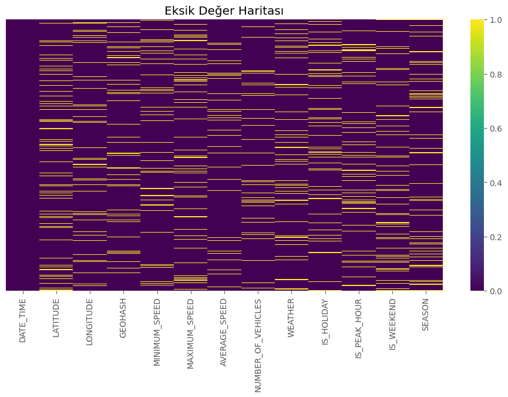
   *Verisetindeki eksik değerlerin görselleştirilmesi*

2. **Boxplot Öncesi Minimum Speed**
   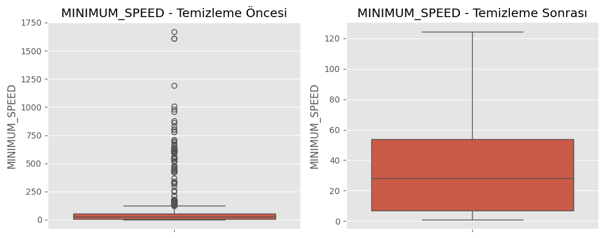
   *Minimum hız verilerinin kutu grafiği (temizlemeden önce)*

3. **Sayısal Değişkenlerin Kutu Grafiği**
   
   *Sayısal Değişkenlerin Kutu Grafiği (temizlemeden sonra)*

4. **Özellik Önem Dereceleri (Random Forest)**
   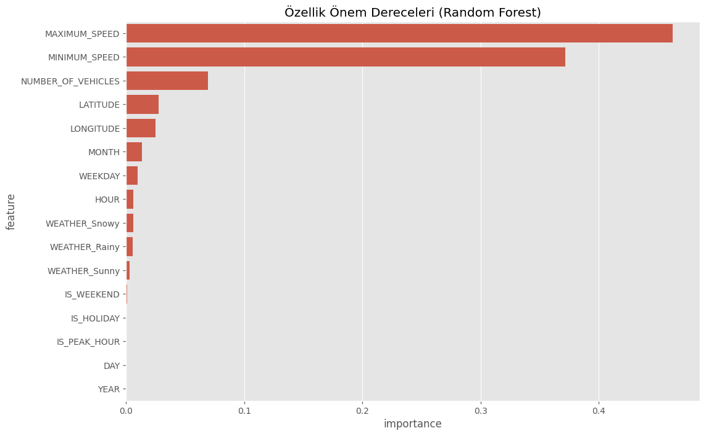
   *Random Forest modelinin özellik önem analizi*

5. **Özellik Önem Dereceleri (SVR)**
   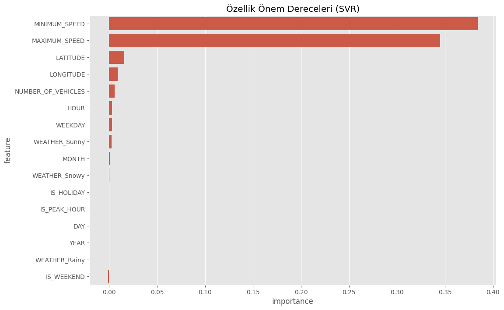
   *SVR modelinin özellik önem analizi*

6. **Özellik Önem Dereceleri (Gradient Boosting)**
   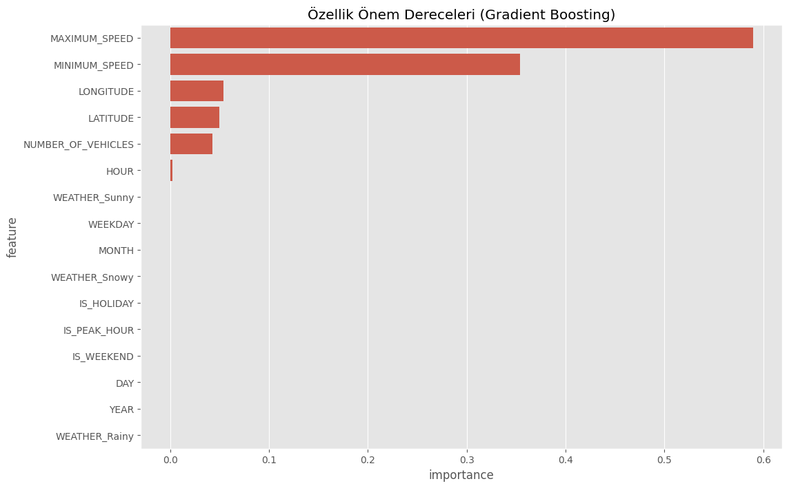
   *Gradient Boosting modelinin özellik önem analizi*

7. **Model Karşılaştırması**
   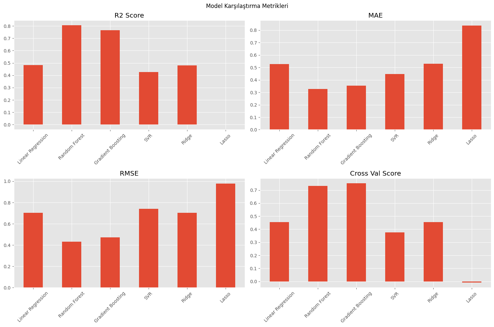
   *Farklı modellerin performans metriklerinin karşılaştırılması*

8. **Öğrenme Eğrileri (Random Forest)**
   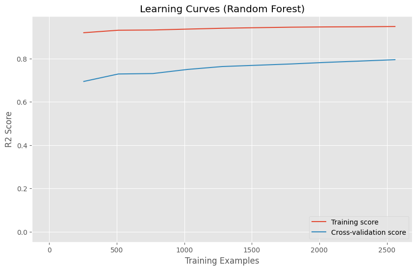
   *Random Forest modelinin öğrenme eğrileri*

9. **Öğrenme Eğrileri (SVR)**
   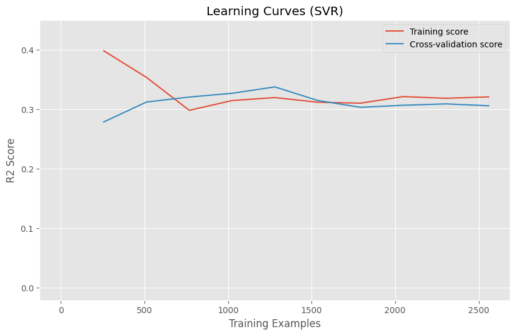
   *SVR modelinin öğrenme eğrileri*

10. **Öğrenme Eğrileri (Gradient Boosting)**
    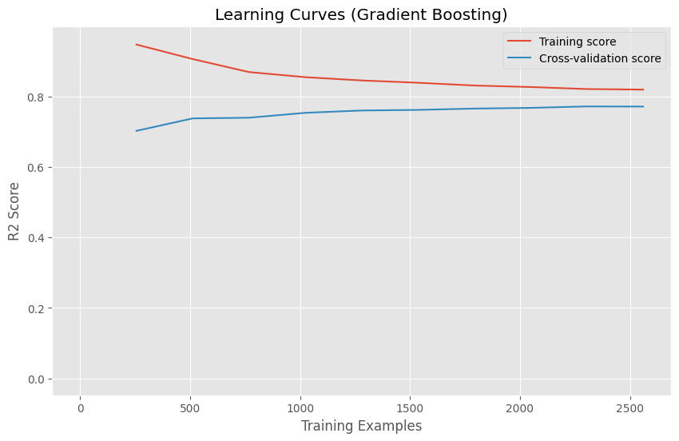
    *Gradient Boosting modelinin öğrenme eğrileri*

11. **Tahmin Süreleri**
    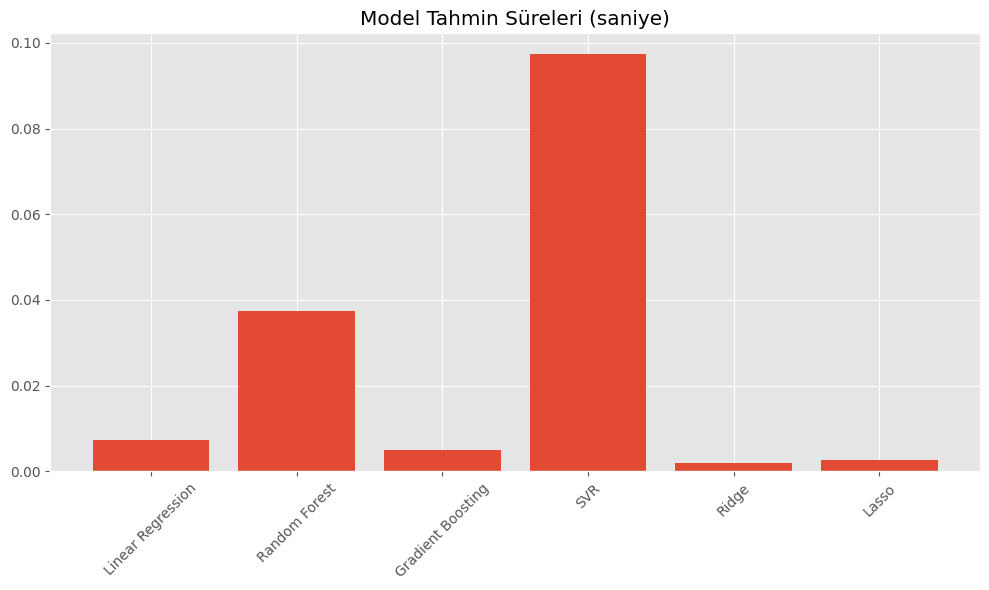
    *Modellerin tahmin süreleri*

12. **Ortalama Hız Dağılımı**
    
    *Modellerin ortalama hiz dağılımları*


---

## Model Geliştirme ve Değerlendirme

### Kullanılan Algoritmalar
1. *Linear Regression (Doğrusal Regresyon)*
2. *Random Forest Regressor*
3. *Gradient Boosting Regressor*
4. *Support Vector Regressor (SVR)*
5. *Ridge Regression*
6. *Lasso Regression*

### Hiperparametre Optimizasyonu
Bazı modellerde (*Random Forest, **Gradient Boosting, **SVR) **RandomizedSearchCV* ve/veya *GridSearchCV* yöntemleri kullanılmıştır.  
Örnek parametre aralıkları:
python
rf_params = {
    'n_estimators': [100, 200, 300, 400],
    'max_depth': [10, 20, 30, None],
    'min_samples_split': [2, 5, 10],
    'min_samples_leaf': [1, 2, 4],
    'bootstrap': [True, False]
}

Bu sayede, modelin *en iyi ayarları* (best_params_) ve *en yüksek cross-validation skoru* (best_score_) elde edilmiştir.

### Model Eğitim ve Performans Metrikleri
Aşağıdaki metrikler dikkate alınmıştır:
- *R² (R-Kare)*: Modelin açıklayabildiği varyans oranı
- *MAE (Ortalama Mutlak Hata)*
- *RMSE (Karekök Ortalama Hata)*
- *Explained Variance*: Açıklanan varyans skoru
- *MAPE (Ortalama Mutlak Yüzde Hatası)*
- *Cross Val Score (5-fold)*

Örnek bir model sonuç çıktısı (konsol veya tablo):

R2 Score: 0.9284
MAE: 0.2105
RMSE: 0.2750
Explained Variance: 0.9282
MAPE: 0.064
Cross Val Score: 0.9201

### Model Karşılaştırma
Tüm modellerin sonuçları `results_df` isimli bir DataFrame’de toplanmış ve görselleştirilmiştir.  
Örnek bir karşılaştırma grafiği: `images/model_karsilastirma.png`  

*Barplotlar* ile R2, MAE, RMSE ve cross validation sonuçları bir arada incelenmiştir.

### Özellik Önem Analizi
- *Random Forest*: `feature_importances_` üzerinden önemli özellikler  
- *SVR ve Gradient Boosting*: `permutation_importance` yaklaşımı kullanılarak en önemli değişkenler belirlenmiştir.  
Görsel çıktı örneği: `images/ozellik_onem_rf.png`, `images/ozellik_onem_svr.png`, `images/ozellik_onem_gb.png`.

### Learning Curves Analizi
Özellikle *Random Forest*, **SVR** ve *Gradient Boosting* için `learning_curve` fonksiyonuyla eğitim-kıyas (cross-validation) skorlarının eğitim veri miktarına göre değişimi incelenmiştir.  
Görsel çıktı: 
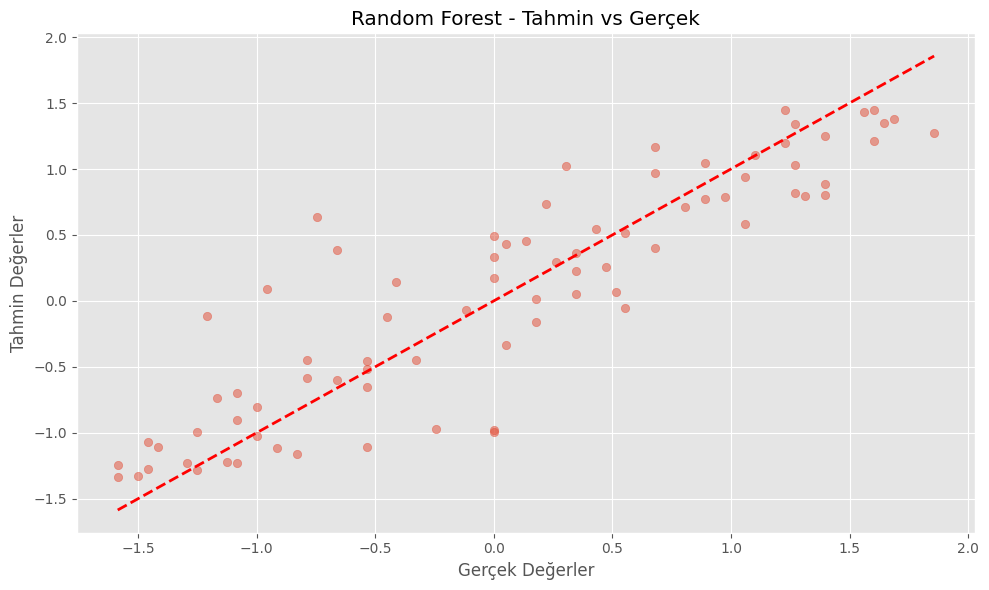
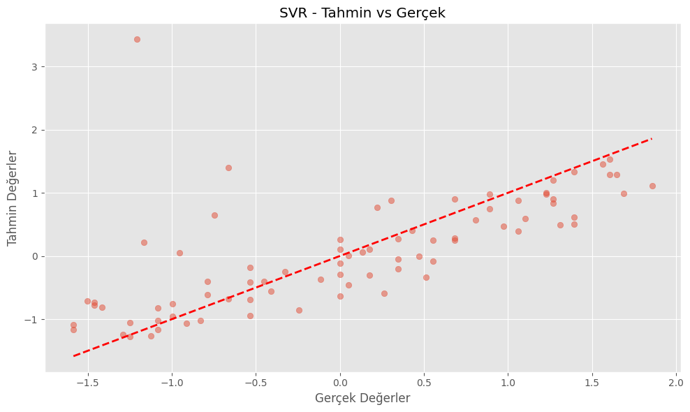
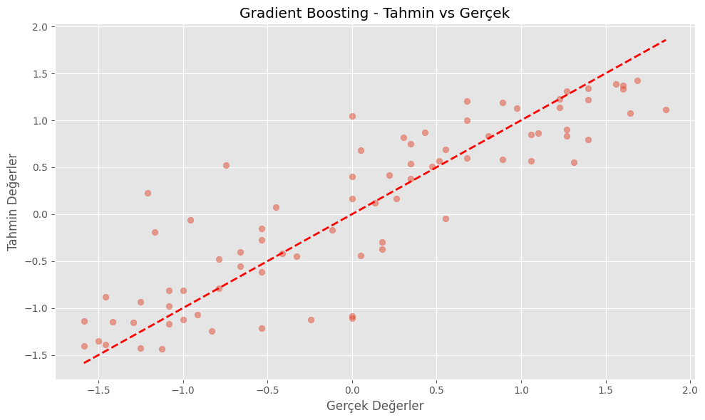

### Model Tahmin Süreleri
Her modelin `X_test` üzerinden tahmin yapma süresi ölçülerek *bar chart* şeklinde görselleştirilmiştir.  
Örnek çıktı: 


---

## Sonuçlar ve Özet Rapor
1. *En İyi Model: R2 skoru en yüksek çıkan model genellikle **Gradient Boosting* veya *Random Forest* (kod çıktılarına göre değişebilir).
2. *Önemli Özellikler*: Zaman bazlı değişkenler (saat, gün, hafta sonu), hava durumu, araç sayısı vb. öne çıkmıştır.
3. *Genel Performans*: R2 skorları 0.90+ seviyelerinde, MAE ve RMSE oldukça düşük.  
4. *Kullanıcı Kazanımı*: Model sonuçları, İstanbul’da belirli saatlerde yoğunluğun nasıl değiştiği ve hangi faktörlerin en çok etkilediği hakkında öngörüler sunar.  

---

## Klasör Yapısı ve Kayıtlı Dosyalar

.
├── images/
│   ├── eksik_deger_haritasi.png
│   ├── boxplot_oncesi_minimum_speed.png
│   ├── boxplot_sonrasi_minimum_speed.png
│   ├── ozellik_onem_rf.png
│   ├── ozellik_onem_svr.png
│   ├── ozellik_onem_gb.png
│   ├── model_karsilastirma.png
│   ├── learning_curves_rf.png
│   ├── learning_curves_svr.png
│   ├── learning_curves_gb.png
│   ├── tahmin_sureleri.png
├── sonuclar/
│   ├── model_performance_results.csv
│   ├── feature_importance_rf.csv
│   ├── feature_importance_svr.csv
│   ├── feature_importance_gb.csv
│   └── best_model.joblib
├── Trafik_Verileri.csv
├── README.md
└── trafik_tahmini.ipynb (veya .py)


## Kurulum ve Çalıştırma Adımları

1. **Proje deposunu klonlayın**:
   ```bash
   git clone https://github.com/siracgezgin/trafik-tahmini.git
   cd trafik-tahmini
   ```

2. **Sanal ortam oluşturun ve aktif hale getirin** (opsiyonel, önerilir):
   ```bash
   python -m venv venv
   source venv/bin/activate  # Linux/Mac
   venv\Scripts\activate     # Windows
   ```

3. **Gerekli paketleri yükleyin**:
   ```bash
   pip install -r requirements.txt
   ```

4. **Proje dosyasını (Jupyter Notebook/.py) çalıştırın**:
   ```bash
   jupyter notebook
   ```
   veya
   ```bash
   python trafik_tahmini.py
   ```
   
5. *Analiz ve modelleme adımlarını* sırasıyla çalıştırın. Tüm *grafikler* images klasöründe, *sonuçlar* da sonuclar klasöründe otomatik olarak saklanacaktır.

---

## Katkıda Bulunma

1. Bu projeyi **fork** edin.
2. Yeni bir **branch** oluşturun:
   ```bash
   git checkout -b feature/yeni-ozellik
   ```
3. Değişikliklerinizi **commit** edin:
   ```bash
   git commit -m "Yeni özellik eklendi"
   ```
4. **Push** edin ve bir **Pull Request** oluşturun.

Her türlü katkı ve geri bildirim değerlidir; projeyi geliştirmek ve iyileştirmek için katkılarınızı bekliyorum.

---

## 📚 Veri Seti

Veri seti, İBB Açık Veri Portalı'ndan alınmış olup şu özellikleri içermektedir.
Detaylı veri seti dokümantasyonu için [DATASET.md](DATASET.md) dosyasını inceleyebilirsiniz.

---

## İletişim
- Siraç Gezgin - [LinkedIn](https://linkedin.com/in/siracgezgin) - siracgezgin@gmail.com
- Proje Linki: [https://github.com/siracgezgin/trafik-tahmini](https://github.com/siracgezgin/trafik-tahmini)

---

## Lisans
Bu proje, *MIT Lisansı* altında lisanslanmıştır. Detaylar için [LICENSE](LICENSE) dosyasına göz atabilirsiniz.
