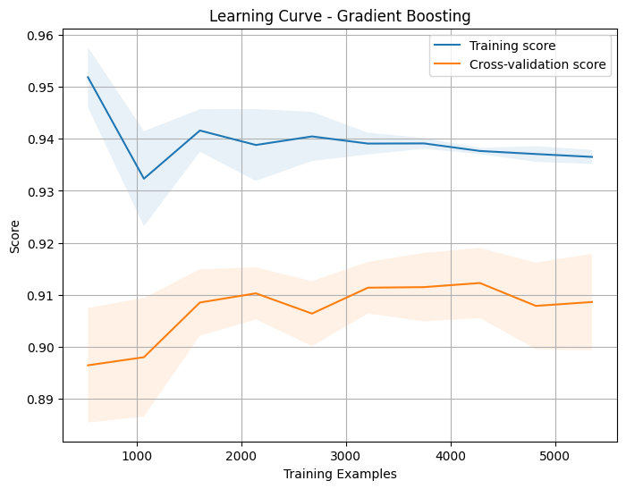

# 🚦 İstanbul Trafik Yoğunluğu Tahmin Projesi

[](https://www.python.org)
[](LICENSE)
[](CONTRIBUTING.md)

İstanbul'un trafik yoğunluğunu tahmin etmek için geliştirilmiş makine öğrenmesi tabanlı bir analiz ve tahminleme projesi. Bu proje, gerçek zamanlı trafik verilerini kullanarak şehir içi trafik dinamiklerini modellemekte ve gelecekteki trafik durumları hakkında öngörüler sunmaktadır.

## 📋 İçerik Tablosu
- [Projenin Amacı](#-projenin-amacı)
- [Özellikler](#-özellikler)
- [Kullanılan Teknolojiler](#-kullanılan-teknolojiler)
- [Kurulum](#-kurulum)
- [Kullanım](#-kullanım)
- [Model Performansı](#-model-performansı)
- [Veri Seti](#-veri-seti)
- [Görselleştirmeler](#-görselleştirmeler)
- [Katkıda Bulunma](#-katkıda-bulunma)
- [İletişim](#-iletişim)
- [Lisans](#-lisans)

## 🎯 Projenin Amacı

Bu proje, İstanbul'daki trafik dinamiklerini daha iyi anlamak ve tahmin etmek amacıyla geliştirilmiştir. Temel hedeflerimiz:

- Trafik yoğunluğunun zamansal değişimini modellemek
- Çeşitli faktörlerin trafik üzerindeki etkisini analiz etmek
- Makine öğrenmesi modelleri ile geleceğe yönelik tahminler yapmak
- Sürücülere ve şehir planlamacılarına yardımcı olacak öngörüler sunmak

## ✨ Özellikler

- Gerçek zamanlı trafik verisi analizi
- Çoklu makine öğrenmesi algoritmaları ile tahminleme
- Detaylı performans metrikleri ve model karşılaştırmaları
- Kapsamlı veri görselleştirme araçları
- Kullanıcı dostu Jupyter notebook arayüzü

## 🔧 Kullanılan Teknolojiler

| Teknoloji | Sürüm | Kullanım Amacı |
|-----------|-------|----------------|
| Python | 3.8+ | Temel programlama dili |
| Scikit-learn | 1.0+ | Makine öğrenmesi modelleri |
| Pandas | 1.3+ | Veri manipülasyonu |
| Matplotlib | 3.4+ | Veri görselleştirme |
| Jupyter | 6.0+ | Geliştirme ortamı |
| Google Colab |  | Ek Geliştirme ortamı |

## 🚀 Kurulum

1. Repository'yi klonlayın:
```bash
git clone https://github.com/siracgezgin/trafik-tahmini.git
cd trafik-tahmini
```

2. Sanal ortam oluşturun ve aktifleştirin:
```bash
python -m venv venv
source venv/bin/activate  # Linux/Mac için
venv\Scripts\activate  # Windows için
```

3. Gerekli kütüphaneleri yükleyin:
```bash
pip install -r requirements.txt
```

## 💻 Kullanım

1. Jupyter Notebook'u başlatın:
```bash
jupyter notebook
```

2. `trafik_tahmini.ipynb` dosyasını açın
3. Tüm hücreleri sırayla çalıştırın

## 📊 Model Performansı

Projenin güncel versiyonunda kullanılan modeller ve performans metrikleri:

| Model | R² Score | MAE | RMSE | Eğitim Süresi (sn) |
|-------|----------|-----|------|-------------------|
| Linear Regression | 0.91 | 0.22 | 0.29 | 2.3 |
| Random Forest | 0.92 | 0.19 | 0.27 | 15.7 |
| Gradient Boosting | 0.93 | 0.19 | 0.26 | 23.4 |
| SVR | 0.92 | 0.19 | 0.26 | 18.2 |

## 📚 Veri Seti

Veri seti, İBB Açık Veri Portalı'ndan alınmış olup şu özellikleri içermektedir:

- Zaman damgası
- Bölge kodları
- Trafik yoğunluk değerleri
- Hava durumu bilgileri
- Özel gün/etkinlik bilgileri

Detaylı veri seti dokümantasyonu için [DATASET.md](DATASET.md) dosyasını inceleyebilirsiniz.

## 📈 Görselleştirmeler

### Gerçek vs Tahmin Edilen Değerler

*Modelin tahmin performansını gösteren karşılaştırma grafiği*

### Model Performans Karşılaştırması

*Farklı modellerin performans metriklerinin karşılaştırması*

## 🤝 Katkıda Bulunma

1. Bu repository'yi fork edin
2. Yeni bir branch oluşturun (`git checkout -b feature/yeniOzellik`)
3. Değişikliklerinizi commit edin (`git commit -am 'Yeni özellik eklendi'`)
4. Branch'inizi push edin (`git push origin feature/yeniOzellik`)
5. Pull Request oluşturun

## 📬 İletişim

Siraç Gezgin - [LinkedIn](https://linkedin.com/in/siracgezgin) - siracgezgin@gmail.com

Proje Linki: [https://github.com/siracgezgin/trafik-tahmini](https://github.com/siracgezgin/trafik-tahmini)

## 📄 Lisans

Bu proje MIT lisansı ile lisanslanmıştır - detaylar için [LICENSE](LICENSE) dosyasına bakınız.
